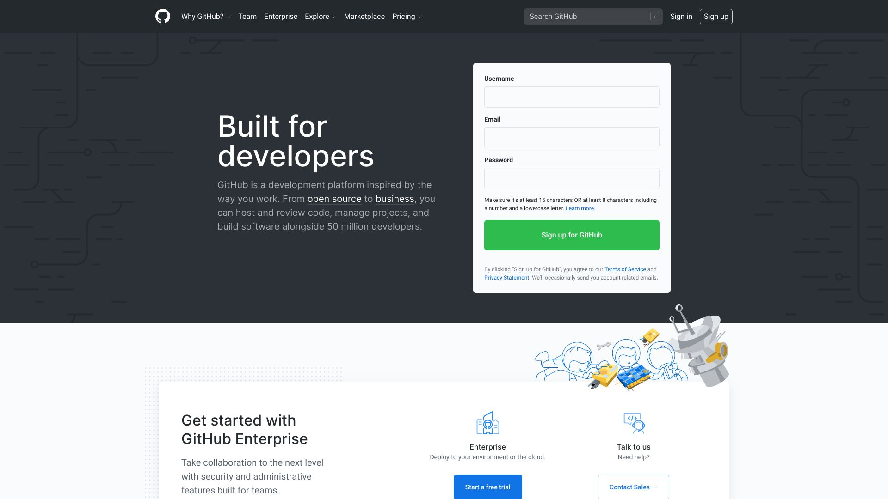

<h1 align="center">Welcome to Unit 17 - Workout Tracker 👋</h1>

  <p align="center">
  <a href="https://desolate-inlet-67133.herokuapp.com" rel="noopener">
 </a>
</p>


<div align="center">

  [](/issues)
  []()  
  [](/issues)
  []()
  []()
  [](https://opensource.org/licenses/mit-license.php)

</div>

---

<p align="center"> A workout tracker assignment built to log exercises progress! Using this app, users are able to view statistics on a dashbaord. This app uses Express, MongoDB, Mongoose, and has been deployed on Heroku.

The assignment had the front end provided via Trilogy however students were required to build all routes and models.

 
</p>

## :package: Repositry
https://github.com/ginganinjar/monash-assignment-17

## 📝 Table of Contents
- [About](#about)
- [Getting Started](#getting_started)
- [Instalation](#deployment)
- [Dependancies](#dependancies)
- [Usage](#usage)
- [License](#license)
- [Authors](#contributing)
- [Acknowledgments](#acknowledgement)
- [Questions](#questions)

## 🧐 Usage <a name = "about"></a>
To provide a full stack MVC application that demonstrates use of both MYSQL, JS and Node.JS development

## 🏁 Getting Started <a name = "getting_started"></a>
These instructions will get you a copy of the project up and running on your local machine for development and testing purposes. See [deployment](#deployment) for notes on how to deploy the project on a live system.

### Installing & 🚀 Deployment <a name = "deployment"></a>

```sh
Clone the repo 

GIT CLONE https://github.com/ginganinjar/monash-assignment-17  from your console.  

Install NPM packages

npm i

NODE server.js


 
 - primarily executable : server.js
```
## :heavy_plus_sign: Dependancies  <a name = "dependancies"></a>
{
 
 "express": "^4.17.1",
 
 "mongoose": "^5.8.10",
 
 "morgan": "^1.9.1"
}

## :mag: Testing  <a name = "built_using"></a>
echo "Error: no test specified" && exit 1

## ✍️ Authors <a name = "contributing"></a>
David. S

## 🎉 Acknowledgements <a name = "acknowledgement"></a>
The guys at trilogy

### :copyright: License <a name = "license"></a>

[License](https://opensource.org/licenses/mit-license.php)

## :question: Questions <a name = "<questions"></a>
Questions, concers, comments ? 

Please feel free to contact me at : https://ginganinjar.github.io/contact.html

Looking forward to hearing from you.
